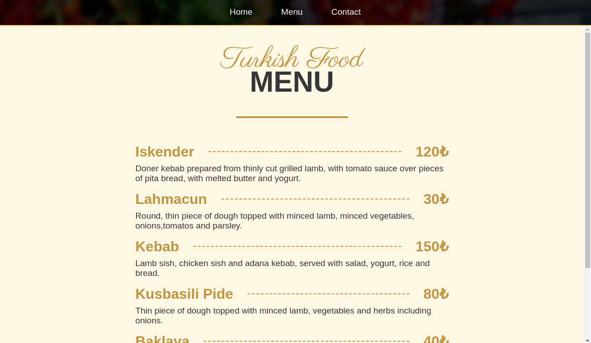
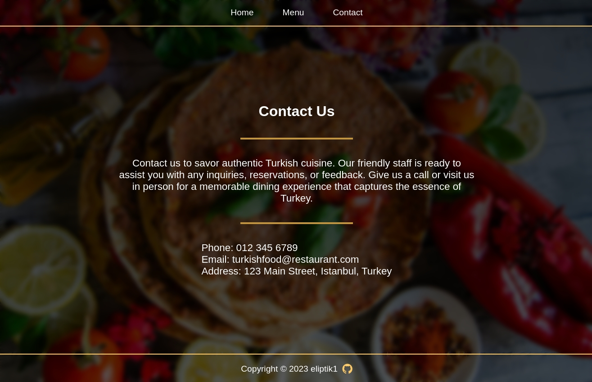

# Restaurant Page

This is a restaurant page project developed to practice ES6 modules, Webpack, and SCSS, creating a dynamic and engaging web experience.

## Technologies Used

- HTML
- CSS (SCSS)
- JavaScript (ES6 modules)
- Webpack
- Git

## Features

- **Dynamic Content:** The restaurant page dynamically loads content using ES6 modules, ensuring an interactive and responsive experience for users.

- **Stylish Design:** Utilizes SCSS to create a visually appealing and modern design that reflects the restaurant's branding.

- **Webpack Integration:** Implements Webpack to efficiently manage and bundle project assets for optimal performance.

## Demo

Check out the live demo: [Restaurant-Page Demo](https://eliptik1.github.io/restaurant-page/)

## Screenshots

## License

This project is open-source and available under the MIT License.
